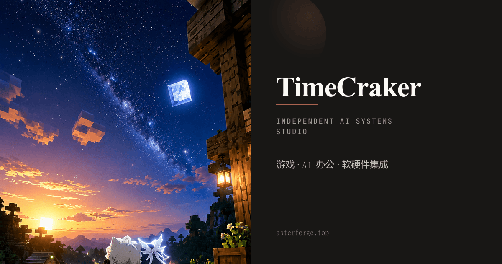
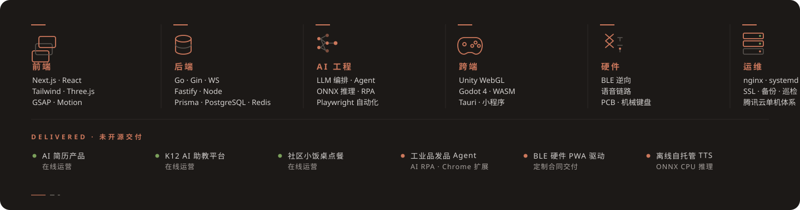

# TimeCraker

**独立架构师 · 全栈 × AI × 硬件**

商业项目独立交付：架构 · 开发 · 部署 · 运维，一人闭环。

[asterforge.top](https://asterforge.top) · [ResumeAIX](https://resume.asterforge.top) · [timecraker@foxmail.com](mailto:timecraker@foxmail.com)

---

## 商业产品 · 在线运营

| 产品 | 一句话 | 线上 |
|---|---|---|
| [`ResuAIX`](https://github.com/TimeCraker/ResuAIX) 🔒 | AI 简历智能生成 + 面试模拟器 · Next.js 16 / Fastify 微服务 / Prisma + PG | [resume.asterforge.top](https://resume.asterforge.top) |
| [`lekao`](https://github.com/TimeCraker/lekao) 🔒 | K12 机构 AI 助教工作台 · 错题集 / 课堂小结 / 课堂反馈 · Next.js / Prisma | [lekao.asterforge.top](https://lekao.asterforge.top) |
| [`xiaofanzhuo`](https://github.com/TimeCraker/xiaofanzhuo) 🔒 | 社区小饭桌点餐 · 顾客扫码点餐 + 商家管理端 · Next.js / Prisma / SQLite | [xiaofanzhuo.asterforge.top](https://xiaofanzhuo.asterforge.top) |

## AsterNova — 3D 动作游戏矩阵

3D 动作游戏 monorepo · Godot 4.7 主客户端 + Next.js 官网 · Go 后端一期封存。

[`games`](https://github.com/TimeCraker/games) monorepo · Godot 4.7 · Next.js · Go

## 内容工厂与基建

| 项目 | 一句话 |
|---|---|
| [`vibe-studio`](https://github.com/TimeCraker/vibe-studio) | 内容创作工作台：PPT 代码生成 → 逐页动效 → Remotion 成片 → 三平台发布 |
| [`my-portfolio`](https://github.com/TimeCraker/my-portfolio) 🔒 | 个人主站 [asterforge.top](https://asterforge.top) · Next.js / Prisma / Three.js |
| [`asterforge-deploy`](https://github.com/TimeCraker/asterforge-deploy) 🔒 | 生产部署权威手册与脚本 · nginx / systemd · 腾讯云单机体系 |
| [`claude-config`](https://github.com/TimeCraker/claude-config) / [`dsh-config`](https://github.com/TimeCraker/dsh-config) 🔒 | AI 编码工具链配置仓 · 多 Agent 工作流基建 |

---

🇨🇳 鄂ICP备2026015662号-1

